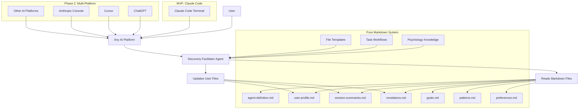
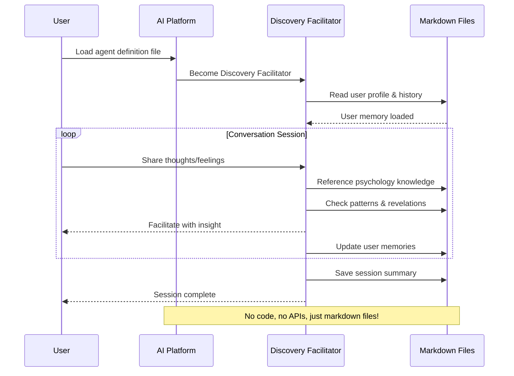

# Personal AI Diary System Architecture Document

## Introduction

This document outlines the system architecture for the Personal AI Diary System, a **pure markdown system** that enables sophisticated conversational diary experiences through self-documenting user files that work with any AI platform.

**Core Philosophy:**
The system is **100% markdown files** with embedded instructions that teach any LLM how to provide intelligent diary facilitation. No code, no installation, no dependencies - just markdown files that contain the entire system logic and user memory.

### Starter Template or Existing Project
Pure BMAD architecture - agent definitions, task workflows, and template-driven file structures with **zero code dependencies**. **MVP**: Optimized exclusively for Claude Code terminal. **Phase 2**: Expansion to ChatGPT, Cursor, and other AI platforms.

### Change Log
| Date | Version | Description | Author |
|------|---------|-------------|---------|
| 2025-08-12 | 1.0 | Initial architecture from PRD analysis | Winston (Architect) |
| 2025-08-12 | 2.0 | Redesigned for markdown-first, LLM-readable approach | Winston (Architect) |
| 2025-08-12 | 3.0 | Eliminated all code - pure markdown system like BMAD | Winston (Architect) |
| 2025-08-13 | 4.0 | Updated for Claude Code MVP focus with Phase 2 multi-platform expansion | Product Owner |

## High Level Architecture

### Technical Summary
The system is **pure markdown files** that contain all system logic, user memory, and behavioral instructions. **MVP**: Optimized for Claude Code terminal with full file system integration. **Phase 2**: Expandable to any AI platform that can read files. No code, APIs, or installation required - just markdown files with embedded LLM instructions.

### High Level Overview
**Architecture Style**: Pure Markdown System (Zero Code)
**Repository Structure**: BMAD agent/task/template structure with only markdown files
**Service Architecture**: Single Discovery Facilitator agent defined entirely in markdown
**User Interaction**: **MVP** - Claude Code terminal exclusively; **Phase 2** - Multi-platform (ChatGPT, Cursor, etc.)
**Data Architecture**: Self-documenting markdown files with embedded LLM instructions

### High Level Architecture Diagram


### Architectural Patterns
- **Zero Code Architecture**: Everything defined in markdown files, no programming required - _Rationale:_ Maximum portability for Phase 2 expansion
- **Self-Documenting Memory**: Markdown files teach LLMs how to use them through embedded comments - _Rationale:_ Works with Claude Code and future platforms
- **Pure BMAD Structure**: Agent, tasks, templates, and data all in markdown - _Rationale:_ Proven pattern for AI systems without code complexity
- **Claude Code Optimized**: MVP leverages Claude Code's native file system capabilities - _Rationale:_ Fastest path to working system
- **Phase 2 Ready**: Architecture designed for multi-platform expansion - _Rationale:_ Foundation supports future growth
- **Human-Readable Everything**: All logic and data transparent to users - _Rationale:_ Trust, transparency, and user control

## Tech Stack

### Infrastructure Requirements
- **Deployment**: No deployment needed - just file distribution
- **Hosting**: User's local machine or any file storage
- **Dependencies**: **ZERO** - works with any AI platform

### Technology Stack Table
| Category | Technology | Version | Purpose | Rationale |
|----------|------------|---------|---------|-----------|
| **Core System** | Markdown Files | N/A | Everything - logic, data, instructions | Universal format, human-readable, LLM-native |
| **Agent Definition** | Markdown | N/A | Complete agent personality and behavior | Self-contained agent in single file |
| **User Memory** | Markdown | N/A | All user data and conversation history | Human and LLM readable, fully transparent |
| **Psychology Engine** | Markdown | N/A | SDT and hierarchy frameworks | Your existing knowledge files work directly |
| **Task System** | Markdown | N/A | Workflow definitions and instructions | BMAD-style task templates |
| **Configuration** | Markdown | N/A | User preferences and agent settings | Human-readable YAML-style sections |
| **AI Platform** | Claude Code (MVP) | N/A | Terminal with file reading capabilities | Phase 2: ChatGPT, Cursor, Anthropic Console |
| **File Storage** | File System | N/A | Standard directories and files | Works everywhere, no database needed |
| **Testing** | Manual | N/A | Test conversations with real AI | No code means no unit tests needed |
| **Deployment** | Copy Files | N/A | Just copy markdown files to user | Simpler than any package manager |

## Data Models (Markdown File Structures)

All user data is stored in **self-documenting markdown files** with embedded LLM instructions. Here are the key file structures:

### User Profile (`profile.md`)
**Purpose**: Core user information with LLM usage instructions

**Example Structure**:
```markdown
# User Profile: [Username]

<!-- LLM INSTRUCTIONS: This file contains the user's core profile. 
     Use this to understand their goals, patterns, and context.
     Always reference evidence from sessions when surfacing information. -->

## Life Goals
<!-- LLM: Goals are categorized by time horizon and psychological type.
     Autonomous goals (user's choice) are stronger than controlled goals (external pressure). -->

### Long-term Goals (Identity & Values)
- **Be a present parent** (Autonomous motivation, Identity level)
  - Evidence: "I want to be there for important moments" (Session 3)
  - Hierarchy: Serves core value of "Family connection"
  - Status: Ongoing commitment

### Time-bound Goals  
- **Finish project by March** (Mixed motivation)
  - Deadline: 2025-03-15
  - Evidence: "I should complete this but I also want the promotion" (Session 5)
  - Status: In progress

## Key Insights
<!-- LLM: These are validated revelations the user has discovered.
     Surface relevant insights when topics match. -->

### Strong Confidence
- "I procrastinate when goals feel overwhelming" (Session 5, validated)
  - Pattern: Breaks big goals into smaller pieces helps
  - Context: Happens with both work and personal projects

### Medium Confidence  
- "Work pressure affects family presence" (Session 1, observation)
  - Evidence: User noticed being distracted during dinner after tough days
  - Needs more validation
```

### Session Summaries (`sessions/summaries.md`)
**Purpose**: Chronological conversation history with thematic tracking

**Example Structure**:
```markdown
# Session Summaries

<!-- LLM INSTRUCTIONS: Use this to understand conversation history and identify patterns.
     Look for recurring themes and emotional progression over time. -->

## Session 5 (2025-08-12)
**Emotional Context**: Frustrated but optimistic
**Main Themes**: Goal overwhelm, breaking down tasks, family time balance
**Revelations Captured**: "I procrastinate when goals feel overwhelming"
**Goals Discussed**: Project deadline, being present parent
**Follow-up Topics**: Explore task breakdown strategies

## Session 4 (2025-08-10)  
**Emotional Context**: Reflective, searching
**Main Themes**: Work-life boundaries, decision making
**Revelations Captured**: None explicit, but noticed pattern of evening stress
**Goals Discussed**: Family connection goal, work promotion goal
**Follow-up Topics**: Work boundary strategies
```

### User Preferences (`preferences.md`)
**Purpose**: Agent behavior configuration in readable markdown

**Example Structure**:
```markdown
# User Preferences

<!-- LLM: Use these settings to adapt your facilitation style.
     Update this file based on user feedback during sessions. -->

## Communication Style
**Tone**: Supportive (warm, encouraging, not clinical)
**Formality**: Casual (relaxed conversation style)  
**Pace**: Patient (don't rush discoveries)

## Facilitation Preferences
**Techniques I Respond Well To:**
- Five Whys (user finds this revealing)
- What If Scenarios (helps user explore possibilities)

**Techniques I Don't Like:**
- First Principles (user finds too analytical)

**Depth Preference**: Medium (not too shallow, not overwhelming)

## Boundaries
**Topics to Avoid**: None specified yet
**Session Length**: Flexible (user prefers natural endings)

## What Works for Me
**I Respond Well To**: Gentle challenges, pattern observations
**Please Avoid**: Direct advice, prescriptive solutions
```

## Components

### Discovery Facilitator Agent (Pure Markdown)
**Responsibility**: Complete AI agent defined in single markdown file

**How It Works**:
- Single `discovery-facilitator.md` file contains entire agent personality
- LLM reads this file and becomes the agent
- Includes psychology knowledge, facilitation techniques, memory instructions
- Works with any AI platform that can read the file

**Dependencies**: None - self-contained markdown file
**Technology**: Pure markdown with embedded instructions

### User Memory System (Self-Documenting Files)
**Responsibility**: Human and LLM-readable user data storage

**File Structure**:
- `user-profile.md` - Core user information with usage instructions
- `session-summaries.md` - Conversation history and patterns  
- `revelations.md` - Captured insights and discoveries
- `goals.md` - Goal hierarchy and psychological analysis
- `preferences.md` - Agent behavior settings in markdown

**Dependencies**: File system only
**Technology**: Self-documenting markdown with LLM instructions

### Knowledge Base (Theoretical Information)
**Responsibility**: Psychology theories and research for agent understanding

**Components**:
- `knowledge/sdt-framework.md` - Self-Determination Theory principles
- `knowledge/goal-hierarchy-theory.md` - Goal hierarchy analysis
- `knowledge/facilitation-psychology-methods.md` - Psychology research
- `knowledge/motivation-language-patterns.md` - Language patterns

**Dependencies**: None - pure knowledge files
**Technology**: Theoretical information that provides context

### Methods Library (Structured Workflows)
**Responsibility**: Practical techniques agent can execute during conversations

**Categories**:
- `methods/facilitation/` - Explore thoughts/feelings deeper
- `methods/brainstorming/` - Generate possibilities and solutions  
- `methods/goal-seeking/` - Clarify and achieve goals

**Method Format**: Simple one-line execution instructions following BMAD patterns
**Integration**: Agent reads all method files and selects most fitting approaches
**Termination**: User-driven completion following BMAD's natural conversation flow approach

### Task Workflow System (BMAD-Style)
**Responsibility**: Define how the agent should behave during sessions

**Components**:
- `facilitate-session.md` - Step-by-step session instructions
- `capture-insights.md` - How to detect and store revelations
- `update-memories.md` - Memory management workflow
- `surface-patterns.md` - Pattern recognition instructions

**Dependencies**: None - instructional markdown files
**Technology**: Task templates that LLM follows

## Platform Integration

### MVP: Claude Code Exclusive
- **Claude Code**: Primary platform with native file reading and perfect integration
- **File System Access**: Full directory structure support for complete AI Diary System
- **Terminal Interface**: Optimized for Claude Code's command-line interaction patterns
- **Project Context**: Seamless agent loading and user file management

### Phase 2: Multi-Platform Expansion
- **ChatGPT**: Upload files or copy-paste agent definition, Custom GPT creation
- **Cursor**: Workspace integration, reads files automatically in IDE environment
- **Anthropic Console**: Upload agent files for custom assistant
- **Local AI**: Any local LLM that can process files
- **Integration**: Just load the agent file and user files - no API calls needed

## Core Workflows



## Database Schema

### File-Based Storage Structure
```yaml
# user-profile.yaml
user_profile:
  life_goals:
    long_term:
      - goal: "Be a present parent"
        motivation_type: "autonomous"
        hierarchy_level: 3
        evidence: ["I want to be there for important moments"]
    time_bound:
      - goal: "Finish project by March"
        deadline: "2025-03-15"
        status: "in_progress"
  
  psychological_patterns:
    - pattern: "Decision avoidance under pressure"
      strength: "medium"
      evidence_sessions: ["session-003", "session-007"]
      
  key_insights:
    - insight: "I procrastinate when goals feel overwhelming"
      confidence: "strong"
      session: "session-005"
      timestamp: "2025-08-12T14:30:00Z"

# session-summaries.yaml  
sessions:
  - session_id: "session-001"
    date: "2025-08-12"
    themes: ["work stress", "family time"]
    revelations: ["Work pressure affects family presence"]
    goals_mentioned: ["Be present parent", "Meet project deadline"]
```

## File Structure

```plaintext
ai-diary-system/
├── discovery-facilitator.md       # Complete AI agent definition
├── tasks/                         # Workflow instructions for agent
│   ├── facilitate-session.md      # How to conduct diary sessions
│   ├── capture-insights.md        # How to detect and store revelations
│   ├── update-memories.md         # Memory management instructions
│   └── surface-patterns.md        # Pattern recognition guidance
├── templates/                     # New user file templates
│   ├── user-profile.md            # Template for new user profiles
│   ├── session-summary.md         # Template for session records
│   └── revelation-format.md       # Template for insights
├── data/                          # Agent knowledge and methods
│   ├── knowledge/                 # Theoretical information for context
│   │   ├── sdt-framework.md       # Self-Determination Theory
│   │   ├── goal-hierarchy-theory.md # Goal hierarchy knowledge
│   │   ├── facilitation-psychology-methods.md # Psychology research
│   │   └── motivation-language-patterns.md # Language patterns
│   └── methods/                   # Structured workflows agent executes
│       ├── facilitation/          # Explore thoughts/feelings deeper
│       │   ├── five-whys.md
│       │   ├── values-archaeology.md
│       │   └── emotion-mapping.md
│       ├── brainstorming/         # Generate possibilities/solutions
│       │   ├── what-if-scenarios.md
│       │   ├── assumption-reversal.md
│       │   └── metaphor-building.md
│       └── goal-seeking/          # Clarify and achieve goals
│           ├── goal-hierarchy-mapping.md
│           ├── obstacle-anticipation.md
│           └── success-visualization.md
├── users/                         # User data directories
│   └── [username]/
│       ├── profile.md             # Core user information
│       ├── preferences.md         # Agent behavior settings
│       ├── session-summaries.md   # Conversation history
│       ├── revelations.md         # Captured insights
│       ├── goals.md               # Goal hierarchy & analysis
│       ├── patterns.md            # Behavioral patterns
│       └── sessions/
│           ├── 2025-08-12.md      # Daily conversation transcripts
│           └── 2025-08-13.md
├── setup-instructions.md          # How to use with different AI platforms
└── README.md                      # System overview and quick start

TOTAL: ~15 markdown files (no code!)
```

## Distribution and Setup

### Distribution Strategy
- **Method**: Simple file download/copy for Claude Code users
- **Package**: Zip file or Git repository with markdown files optimized for Claude Code
- **Installation**: Copy files to Claude Code project directory - that's it!

### Setup Process
1. **Download**: Get the markdown file system optimized for Claude Code
2. **Create User Directory**: `mkdir users/[your-name]/` in Claude Code project
3. **Copy Templates**: Use templates to create initial user files in Claude Code
4. **Load Agent**: Open `discovery-facilitator.md` in Claude Code terminal
5. **Start Session**: Begin conversation with agent in Claude Code

### Claude Code Setup (MVP)
- **Claude Code**: Open folder as project in Claude Code terminal
- **Agent Loading**: Agent auto-loads with full file system access
- **File Management**: Native Claude Code file reading and writing
- **Session Flow**: Optimized for Claude Code's terminal interface

### Phase 2 Setup (Future)
- **ChatGPT**: Upload agent file or copy-paste into custom GPT
- **Cursor**: Open as workspace, agent reads files automatically
- **Anthropic Console**: Upload agent files for custom assistant

## Error Handling Strategy

### General Approach
- **Error Model**: Exception-based with user-friendly messages
- **Exception Hierarchy**: Custom exceptions for AI, Memory, and File operations
- **Error Propagation**: Graceful degradation with offline mode capabilities

### Logging Standards
- **Library**: loguru 0.7+
- **Format**: JSON structured logs for debugging, simple text for users
- **Levels**: DEBUG (development), INFO (user actions), ERROR (failures)
- **Required Context**: session_id, username, operation type

### Error Patterns

#### External API Errors
- **Retry Policy**: Exponential backoff, 3 retries max
- **Circuit Breaker**: Disable API after 5 consecutive failures
- **Timeout Configuration**: 30 seconds for AI calls, 5 seconds for file operations
- **Error Translation**: Technical errors become user-friendly messages

#### File Operation Errors
- **File Locking**: Prevent concurrent writes with file locks
- **Backup Strategy**: Automatic backups before destructive operations
- **Recovery**: Restore from backup on corruption detection

## File Standards

### Markdown Formatting Standards
- **Consistent Headers**: Use standard markdown hierarchy (# ## ### ####)
- **LLM Instructions**: Use `<!-- LLM: -->` comments to guide AI behavior
- **Evidence References**: Always include session references and quotes
- **Date Formats**: Use ISO format (2025-08-12) for consistency

### Critical Rules
- **Privacy Protection**: User directories completely isolated
- **Evidence-Based Memory**: All insights must reference specific sessions
- **Self-Documentation**: Every user file must teach LLM how to use it
- **Template Consistency**: Follow established templates for new user files
- **Markdown Purity**: No code dependencies, everything in readable text

### File Naming Conventions
| Element | Convention | Example |
|---------|------------|---------|
| Agent Files | kebab-case | `discovery-facilitator.md` |
| User Files | kebab-case | `session-summaries.md` |
| User Directories | lowercase | `users/john/` |
| Session Files | date-format | `2025-08-12.md` |
| Task Files | kebab-case | `facilitate-session.md` |

### User File Standards
- **LLM Instructions**: `<!-- LLM: -->` comments explain file purpose
- **Evidence Tracking**: Session references for all user data
- **Update Instructions**: Clear guidance on when/how to update
- **Human Readable**: Users can understand their own data

## Testing Strategy

### Testing Philosophy
- **Approach**: Manual conversation testing with real AIs
- **Focus**: Agent behavior, memory management, psychology integration
- **No Unit Tests**: No code to test - everything is in markdown

### Testing Process

#### Agent Behavior Testing
- **Method**: Load agent in different AI platforms and test conversations
- **Focus**: Psychology knowledge application, facilitation technique selection
- **Validation**: Agent follows SDT framework and goal hierarchy theory

#### Memory System Testing
- **Method**: Multi-session conversations to test memory persistence
- **Focus**: Revelation capture, pattern detection, insight surfacing
- **Validation**: User files updated correctly with evidence references

#### Claude Code Testing (MVP)
- **Platform**: Claude Code terminal exclusively for MVP validation
- **Focus**: Agent optimization, memory file access, terminal workflow
- **Validation**: Optimized behavior within Claude Code environment

#### Phase 2: Cross-Platform Testing
- **Platforms**: ChatGPT, Cursor, Anthropic Console
- **Focus**: Agent file compatibility, memory file access across platforms
- **Validation**: Consistent behavior when expanding to other platforms

### What We Test
- **Agent Definition**: Does LLM correctly interpret agent instructions?
- **Memory Management**: Are user files updated appropriately?
- **Psychology Integration**: Does agent apply SDT and hierarchy frameworks?
- **Template Generation**: Do new user files follow proper structure?

### What We DON'T Test
- **Code Logic**: There is no code to test
- **API Integration**: Platform handles API calls
- **Performance**: File operations are simple and fast
- **Security**: File-based system has minimal attack surface

## Security

### Input Validation
- **Validation Library**: Pydantic for data models, built-in validation for CLI
- **Validation Location**: At CLI boundary and data model creation
- **Required Rules**: All user input validated, file paths restricted to user directories

### Secrets Management
- **Development**: .env files with .env.example template
- **Production**: Environment variables on user's machine
- **Code Requirements**: Never hardcode API keys, use configuration management

### File Security
- **User Isolation**: Complete directory separation, no cross-user access
- **File Permissions**: Restrict access to user's data directory only
- **Path Traversal Prevention**: Validate all file paths within user boundaries

### API Security
- **Rate Limiting**: Respect Claude API limits with exponential backoff
- **Request Validation**: Validate all API requests before sending
- **Error Handling**: Never expose API responses directly to users

## Performance Optimization

### Session Update Performance
- **Target**: 10-second maximum for background updates
- **Strategy**: Async processing with timeout cancellation
- **Fallback**: Retry failed updates during natural conversation breaks

### Memory Management
- **File Size Limits**: YAML files capped at 1MB per user
- **Cleanup Strategy**: Archive old sessions after 2 years
- **Caching**: In-memory session context to reduce file reads

## Next Steps - Ready for Developer Agent

**✅ ARCHITECTURE COMPLETE** - Ready for implementation phase

**What's Ready:**
- Complete architecture document with pure markdown system design
- Methods library with 11 core facilitation techniques created
- Psychology knowledge files moved to proper structure
- User-driven termination protocol defined
- BMAD-inspired simple method execution approach

### Immediate Developer Tasks
1. **Create Discovery Facilitator Agent** (`discovery-facilitator.md`)
   - Single markdown file with complete agent personality
   - Include method selection protocol (offer 2 choices)
   - Integrate user-driven termination rules
   - Reference all files in `data/knowledge/` and `data/methods/`

2. **Build User File Templates** (`templates/` directory)
   - `user-profile.md` - Self-documenting with LLM instructions
   - `session-summaries.md` - Conversation history template
   - `revelations.md` - Insights capture template
   - `goals.md` - Goal hierarchy template
   - `preferences.md` - Agent behavior settings

3. **Create Task Files** (`tasks/` directory)
   - `facilitate-session.md` - Session workflow
   - `capture-insights.md` - Revelation processing
   - `update-memories.md` - Memory management

4. **Test & Validate**
   - Test agent definition with actual conversations
   - Validate method execution follows BMAD patterns
   - Confirm user-driven termination works naturally

### File Structure Status
```
✅ data/knowledge/ - Psychology knowledge ready
✅ data/methods/ - 11 methods created and ready
⏳ discovery-facilitator.md - NEEDS CREATION
⏳ templates/ - NEEDS CREATION  
⏳ tasks/ - NEEDS CREATION
⏳ users/[example]/ - NEEDS EXAMPLE USER FILES
```

### Revolutionary Advantages
- **Zero Code**: Eliminate all programming - pure markdown system
- **Universal Compatibility**: Works with any AI platform that can read files
- **Complete Transparency**: Users can read and understand everything
- **Your Work Fits Perfectly**: Your existing psychology files work directly
- **True BMAD Style**: Agent, tasks, templates, data - all in readable markdown
- **No Installation**: Just copy files and start using
- **No Dependencies**: No APIs, no databases, no frameworks
- **User Ownership**: Complete control over personal data

### The Result
**A 15-file markdown system** that provides sophisticated AI diary facilitation with zero code dependencies. Users can run it anywhere, understand everything, and maintain complete control over their data.

**This is the future of AI systems** - human-readable, transparent, and infinitely portable! 🚀

## System Extensibility Guide

### Adding New Psychology Knowledge

**How to Add**: Create new markdown files in `data/knowledge/` directory
**Why It Works**: Agent reads all knowledge files for theoretical understanding

**Example - Adding Cognitive Behavioral Therapy (CBT):**
```markdown
# data/knowledge/cbt-framework.md

# Cognitive Behavioral Therapy Framework

<!-- LLM: Use this framework to understand thought-feeling-behavior connections -->

## Thought-Feeling-Behavior Triangle
- **Thoughts** influence feelings and behaviors
- **Feelings** influence thoughts and behaviors  
- **Behaviors** influence thoughts and feelings

## Common Cognitive Distortions
- All-or-nothing thinking
- Catastrophizing  
- Mind reading
- Emotional reasoning

## Key Insights for Conversations
- Thoughts and feelings are connected but separate
- Changing thoughts can change emotional experience
- Behavioral changes can shift thought patterns
```

**Result**: Agent gains CBT understanding but doesn't automatically apply techniques - methods are separate!

### Adding New Methods

**How to Add**: Create method files in appropriate `data/methods/` subdirectory
**Why It Works**: Agent selects from all available methods based on user situation

**Example - Adding CBT Thought Challenge Method:**
```markdown
# data/methods/facilitation/thought-challenging.md

**Thought Challenging**: Ask "What evidence supports this thought?" then explore evidence together

**When to use**: When user expresses negative or limiting beliefs about themselves
**Natural completion**: When user finds balanced perspective or changes subject  
**Capture**: Reframed thoughts and evidence in revelations.md

**Example flow:**
- "What evidence do you have that supports this belief?"
- [wait for their response]
- "What evidence might contradict it?"
- [continue until balanced view emerges]
```

**Example - Adding Goal Visioning Method:**
```markdown
# data/methods/goal-seeking/success-visualization.md

**Success Visualization**: Ask "What would achieving this goal look like?" then explore the vision in detail

**When to use**: When user has goal but lacks motivation or clear picture
**Natural completion**: When vivid success image emerges or user seems inspired
**Capture**: Success vision and motivating details in goals.md

**Example flow:**
- "What would success look like if you achieved this goal?"
- [wait for their description]  
- "Tell me more about that - what would you see, feel, experience?"
- [continue until vision is clear and motivating]
```

### Why This Extensibility Works

1. **Separated Concerns**: Knowledge provides context, methods provide action
2. **Agent Reads All Files**: Loads entire `data/knowledge/` and `data/methods/` directories  
3. **Contextual Selection**: Agent chooses appropriate methods based on user situation
4. **No Code Dependencies**: Pure markdown means immediate integration
5. **Simple Method Format**: One-line instructions following BMAD patterns
6. **Natural Integration**: Methods enhance conversation flow without disruption

### Method Termination Protocol (BMAD-Inspired)

**Critical Implementation Rule**: Agent continues current method until user naturally signals completion

**User-Driven Termination Signals:**
- Changes the subject or asks different type of question
- Expresses insight: "That's interesting" / "I never thought of that"
- Shows resistance: "I don't know what else to say" / silence
- Explicitly requests change: "Let's try something else" / "Can we explore differently?"
- Natural conversation shift to new topic

**Agent Rules:**
- **Never decide when method is complete** - user controls transitions
- **Respond to user cues** rather than internal method logic
- **Don't switch methods autonomously** - wait for user signals
- **Trust conversation flow** rather than artificial structure
- **No progress tracking required** - natural dialogue provides termination

**Example Natural Flow:**
```
Agent: "We could explore why this matters with Five Whys, or imagine possibilities with What If scenarios?"
User: "Let's try the why approach"
Agent: "Why is this project important to you?"
User: "I want the promotion for security"
Agent: "Why is that security important?"
User: "So my family doesn't worry about money"
Agent: "Why does reducing their worry matter to you?"
User: "Because I love them and want them happy. Actually, that makes me think about work-life balance too..."
Agent: [Recognizes topic shift - method naturally complete, follows new direction]
```

**This leverages natural human conversation patterns rather than forced structure.**

### Best Practices for Extensions
- **Clear LLM Instructions**: Always include `<!-- LLM: -->` comments
- **Integration Guidance**: Explain how to combine with existing frameworks  
- **Practical Application**: Include specific questions/techniques for agent use
- **Evidence-Based**: Reference established psychological/business theories
- **User Termination**: Include natural completion signals in method descriptions